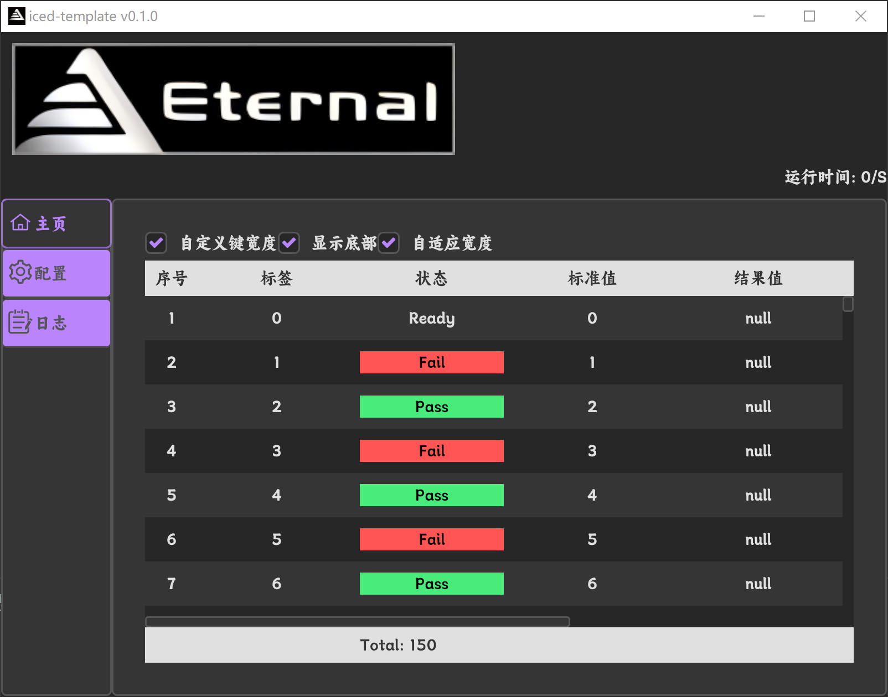
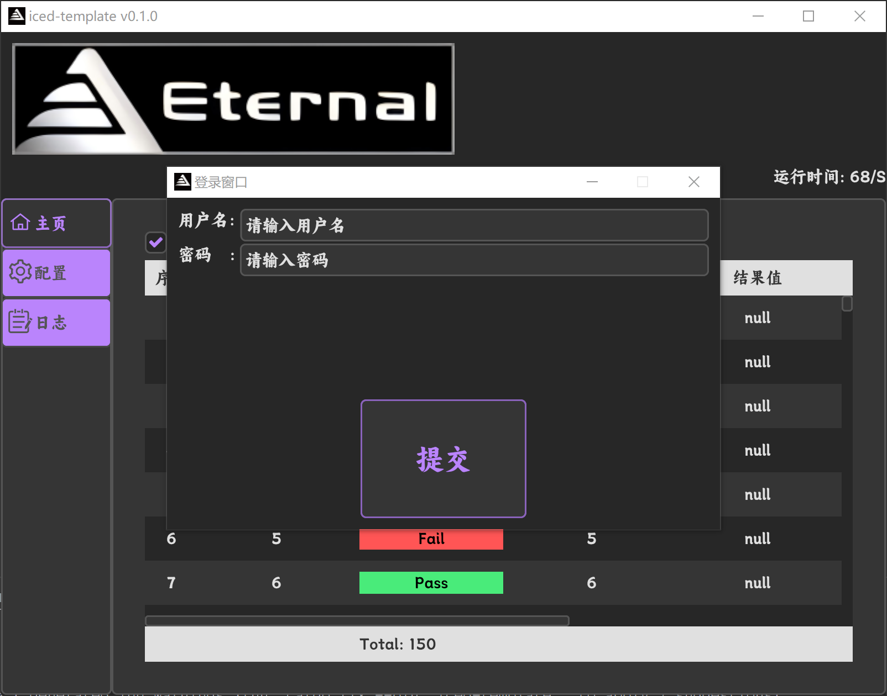
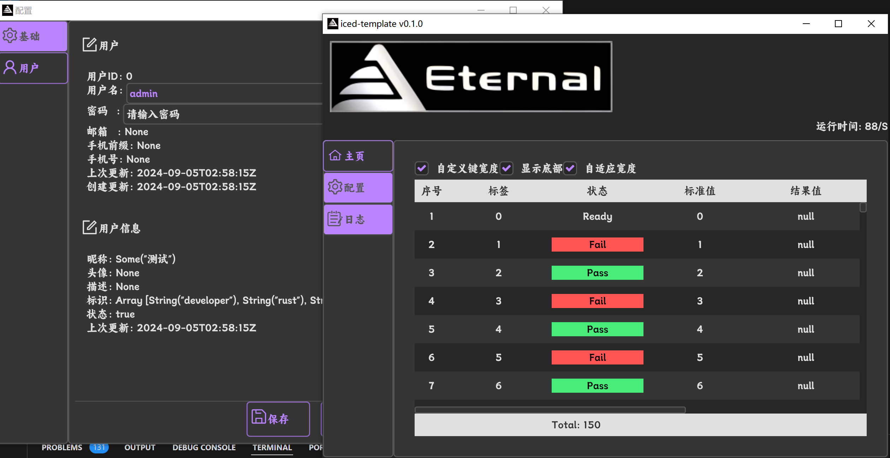
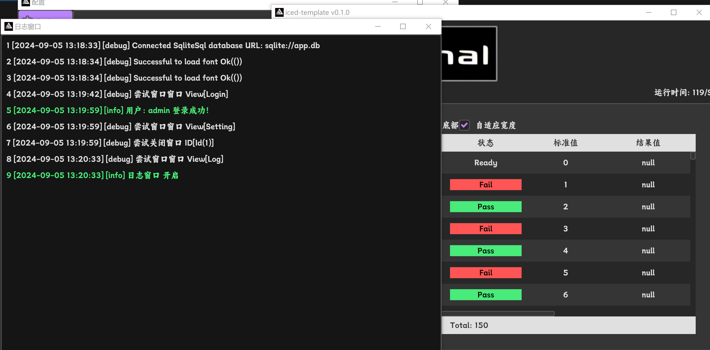

# 主窗口

# 登录窗口

# 配置窗口

# 日志窗口


# Iced Project Simple Template

## UI Framework
- Iced

## Configuration Storage and Reading
- sqlx (SQLite database)

## UI Display List
- iced-table

## Logging Framework
- e-log (tracing)
  - Supports error capture and popup prompts

# Run the Project
```bash
cargo run
```

# Build project on windows
```bash
cd scripts
./build.bat
```
